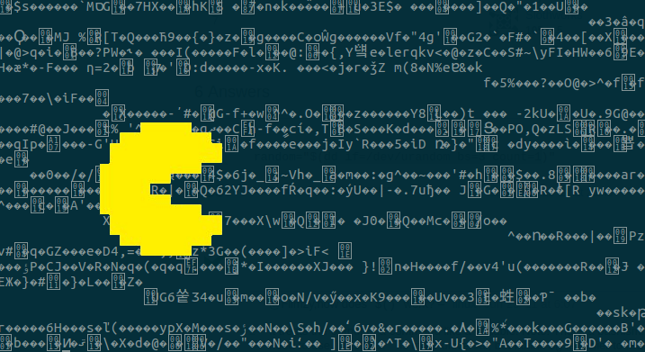

# shellcode-eater
Eats shellcode hex and executes it (like pacman)



## Building

```
$ cd src
$ make
```

## Adding samples

Please add new `.asm` files to the payloads directory

## Usage

To help you get the hex out from your assembler run the `./dumpasm.sh` script
e.g.

```
$ ./dumpasm.sh payloads/execve-bin-sh.asm
eb0b5f4831d24889d6b03b0f05e8f0ffffff2f62696e2f736800
```
